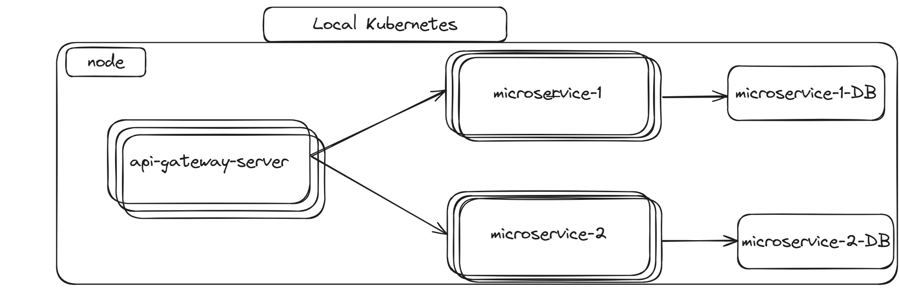

# Local-MicroService-Practice
로컬 쿠버네티스 환경에서 마이크로 서비스를 실행하는 간단한 프로젝트입니다.

## 커밋 규칙
| init | 프로젝트 생성 |
| --- | --- |
| feat | 새로운 기능에 대한 커밋 |
| build | 빌드 관련 파일 수정 / 모듈 설치 또는 삭제에 대한 커밋 |
| chore | 그 외 자잘한 수정에 대한 커밋 |
| docs | 문서 수정에 대한 커밋 |
| style | 코드 스타일 혹은 포맷 등에 관한 커밋 |
| refactor | 코드 리팩토링에 대한 커밋 |
| test | 테스트 코드 수정에 대한 커밋 |
| perf | 성능 개선에 대한 커밋 |

---
## 프로젝트 구조 작성

